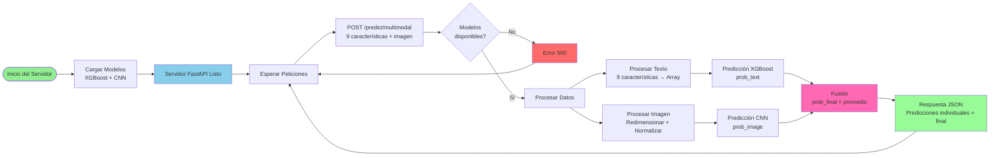

# Diagrama de Flujo del Backend

```mermaid
flowchart LR
    Start([Inicio del Servidor]) --> LoadModels[Cargar Modelos<br/>XGBoost + CNN]
    LoadModels --> ServerReady[Servidor FastAPI Listo]
    ServerReady --> WaitRequest[Esperar Peticiones]
  
    WaitRequest --> Request[POST /predict/multimodal<br/>9 características + imagen]
  
    Request --> Validate{Modelos<br/>disponibles?}
    Validate -->|No| Error[Error 500]
    Validate -->|Sí| ProcessData[Procesar Datos]
  
    ProcessData --> ProcessText[Procesar Texto<br/>9 características → Array]
    ProcessData --> ProcessImage[Procesar Imagen<br/>Redimensionar + Normalizar]
  
    ProcessText --> PredictText[Predicción XGBoost<br/>prob_text]
    ProcessImage --> PredictImage[Predicción CNN<br/>prob_image]
  
    PredictText --> Fusion[Fusión<br/>prob_final = promedio]
    PredictImage --> Fusion
  
    Fusion --> Response[Respuesta JSON<br/>Predicciones individuales + final]
    Response --> WaitRequest
    Error --> WaitRequest
  
    style Start fill:#90EE90
    style ServerReady fill:#87CEEB
    style Fusion fill:#FF69B4
    style Response fill:#98FB98
    style Error fill:#FF6B6B
```
